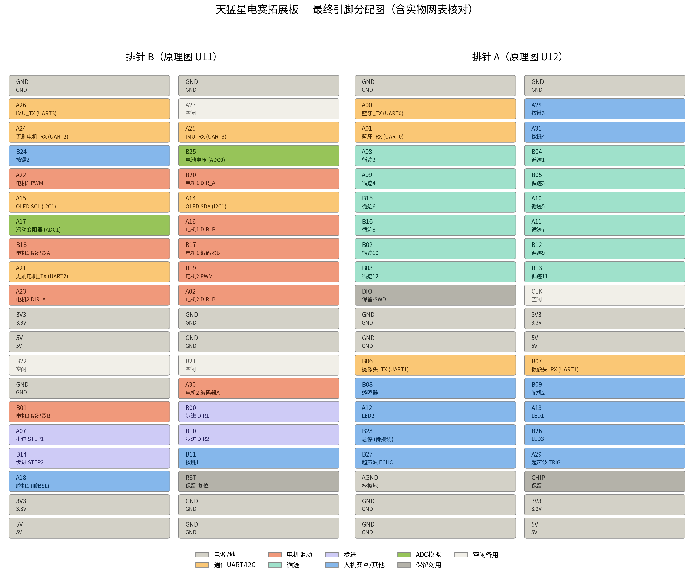

# 天猛星电赛拓展板

**仓库工程名：`tianmengxing-expansion-board`**

面向 **立创·天猛星 MSPM0G3507 开发板**（`LCKFB-TMX-MSPM0G3507`）的电赛外设拓展板设计。  
在天猛星原板 80P 双排针基础上，把电机驱动、循迹、传感器、显示等人机与运动外设的接口整理到一块板子上，方便全国大学生电子设计竞赛控制类题目快速搭车、改线与复用。

> 核心 MCU 开发板本身不重新设计，本仓库发布的是 **对接天猛星排针的拓展底板/转接扩展工程**（嘉立创 EDA 专业版工程 + 网表 + 引脚分配图）。

---

## 功能概览

| 类别 | 能力 |
|------|------|
| **主控对接** | 兼容天猛星 MSPM0G3507 开发板 2×20 排针（原理图 U11 / U12） |
| **直流电机** | 双路有刷电机：PWM + 方向（AIN/BIN）+ 编码器 A/B |
| **步进电机** | 双路步进：STEP / DIR |
| **舵机** | 舵机 1（兼 BSL）、舵机 2 |
| **循迹** | 12 路循迹传感器接口 |
| **测距** | 超声波 TRIG / ECHO |
| **姿态** | IMU 串口（UART3） |
| **无刷** | 无刷电调串口（UART2） |
| **蓝牙** | 蓝牙串口（UART0） |
| **摄像头** | 串口摄像头（UART1） |
| **显示** | 0.96 寸 OLED（I2C：SDA/SCL） |
| **人机** | 按键 ×4、LED ×3、蜂鸣器、滑动变阻器（ADC） |
| **电源监测** | 电池电压 ADC |
| **电源** | 板载 5V 降压（TPS5450）、3.3V LDO（AMS1117-3.3）、自恢复保险丝、防反接二极管等 |

---

## 仓库内容

```
tianmengxing-expansion-board/
├── README.md
├── docs/
│   ├── pinout.png      # 最终引脚分配图（含实物网表核对）
│   └── PINMAP.md       # 排针 A/B 文字引脚表
└── hardware/
    ├── tianmengxing-expansion-board.epro   # 嘉立创 EDA 专业版工程
    └── schematic-netlist.enet              # 原理图网表（接线依据）
```

| 文件 | 说明 |
|------|------|
| `hardware/tianmengxing-expansion-board.epro` | 完整工程（符号、封装、原理图等），用 **嘉立创 EDA 专业版 / EasyEDA Pro** 打开 |
| `hardware/schematic-netlist.enet` | 原理图网表导出，记录各器件引脚与网络连接 |
| `docs/pinout.png` | **最终引脚分配图**（已与实物网表核对） |
| `docs/PINMAP.md` | 排针文字对照表 |

---

## 引脚分配图



图中双排针对应天猛星开发板：

- **排针 A**：原理图 `U12`
- **排针 B**：原理图 `U11`

颜色大致分类：

| 颜色含义 | 功能 |
|----------|------|
| 灰 | 电源 / 地 |
| 橙红 | 电机驱动 |
| 紫 | 步进 |
| 绿 | ADC 模拟 |
| 黄 | 通信 UART / I2C |
| 青 | 循迹 |
| 蓝 | 人机交互 / 其他 |
| 深灰 | 保留 / 勿用 |
| 白 | 空闲备用 |

### 功能与 MCU 引脚速查（节选）

#### 通信

| 功能 | MCU 引脚 | 网络名（网表） |
|------|----------|----------------|
| 蓝牙 TX / RX | A00 / A01 | TX_UART0 / RX_UART0 |
| 摄像头 TX / RX | B06 / B07 | TX_UART1 / RX_UART1 |
| 无刷 TX / RX | A21 / A24 | TX_UART2 / RX_UART2 |
| IMU TX / RX | A26 / A25 | IMU_TX_UART3 / IMU_RX_UART3 |
| OLED SDA / SCL | A14 / A15 | SDA / SCL |

#### 电机与运动

| 功能 | MCU 引脚 | 网络名 |
|------|----------|--------|
| 电机 1 PWM / DIR_A / DIR_B | A22 / B20 / A16 | PWMA / AIN1 / AIN2 |
| 电机 1 编码器 A / B | B18 / B17 | E1A / E1B |
| 电机 2 PWM / DIR_A / DIR_B | B19 / A23 / A02 | PWMB / BIN1 / BIN2 |
| 电机 2 编码器 A / B | A30 / B01 | E2A / E2B |
| 步进 STEP1 / DIR1 | A07 / B00 | STEP1 / DIR1 |
| 步进 STEP2 / DIR2 | B14 / B10 | STEP2 / DIR2 |
| 舵机 1 / 舵机 2 | A18 / B09 | SERVO1 / SERVO2 |

#### 传感器与人机

| 功能 | MCU 引脚 | 网络名 |
|------|----------|--------|
| 循迹 1～12 | B04,A08,B05,A09,A10,B15,A11,B16,B12,B02,B13,B03 | TRACK1～TRACK12 |
| 超声波 TRIG / ECHO | A29 / B27 | TRIG / ECHO |
| 按键 1～4 | B11,B24,A28,A31 | KEY1～KEY4 |
| LED1 / LED2 / LED3 | A13 / A12 / B26 | LED1 / LED2 / LED3 |
| 蜂鸣器 | B08 | BUZZER |
| 滑动变阻器 | A17 | CODER |
| 电池电压 | B25 | ADC_battery |

完整 80 脚映射请直接对照 [引脚分配图](docs/pinout.png) 与 [PINMAP.md](docs/PINMAP.md)。

---

## 如何打开工程

1. 安装 [嘉立创 EDA 专业版](https://pro.lceda.cn/)（或 EasyEDA Pro）。
2. 打开 `hardware/tianmengxing-expansion-board.epro`。
3. 接线与网络以 `hardware/schematic-netlist.enet` 与引脚图为准；若与旧草稿冲突，**以引脚分配图（含实物网表核对）为最终版本**。

网表为 JSON（`version: 2.0.0`），可用文本编辑器或脚本解析 `components[*].pinInfoMap` 查看每个器件引脚连接的网络名。

---

## 板载主要器件（摘要）

| 位号 | 型号 / 说明 |
|------|-------------|
| U1 | 立创·天猛星 `LCKFB-TMX-MSPM0G3507`（对接插座） |
| U11 / U12 | 2×20P 2.54mm 排针（天猛星引脚扩展） |
| U2 | `TPS5450QDDARQ1` 5A 宽输入降压 → 5V |
| U6 | `AMS1117-3.3` → 3.3V |
| U8 | 0.96 寸 OLED（I2C） |
| BUZZER1 | 无源电磁蜂鸣器 |
| SW1～SW4 | 轻触按键 |
| F1 | 自恢复保险丝 |
| DC1 | DC-005 电源座 |

完整物料见工程 BOM / 网表中的 `Supplier Part`（立创编号）字段。

---

## 适用场景

- 电赛控制题：循迹小车、双电机差速、超声避障、舵机云台等
- 天猛星 / TI MSPM0 课程实验外设底板
- 需要固定引脚分配、减少杜邦线飞线的实验室量产小板

---

## 许可与说明

- 硬件工程来自作者本地嘉立创 EDA 设计导出，发布便于学习、复现与二次修改。
- 天猛星开发板为立创开源硬件产品，相关商标与原板版权归原厂所有。
- 使用前请自行核对供电电压、电机驱动电流与接口电平，避免损坏 MCU 与外设。

---

## 作者

河北科技大学 · 科技开放实验室  
欢迎 Issue / PR 反馈引脚错误或改进建议。
